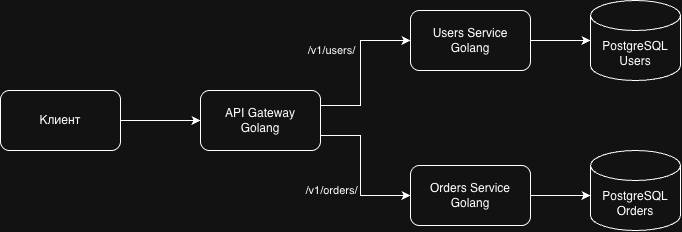
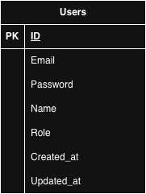

# Микросервисный API Gateway для сервисов пользователей и заказов с JWT аутентификацией.

# Схема микросервисов

# Схема база данных Users

# Схема база данных Orders

#

Аутентификация
API использует JWT Bearer token аутентификацию. Добавьте токен в заголовок Authorization:

Authorization: Bearer <your_jwt_token>

Роли пользователей

Инженер - базовые права

Руководитель и Менеджер - расширенные права (доступ к списку всех пользователей)

Endpoints
🔐 Аутентификация
Регистрация пользователя
http
POST /v1/auth/register
Описание: Создание нового аккаунта пользователя

Тело запроса:

json
{
"email": "string",
"password": "string",
"role": "Исполнитель|Руководитель|Инженер",
"name": "string"
}
Ответы:

200 OK - Пользователь успешно создан

json
{
"id": 1,
"email": "user@example.com",
"name": "Иван Иванов",
"role": "Исполнитель",
"token": "Bearer eyJhbGciOiJIUzI1NiIsInR5cCI6IkpXVCJ9...",
"created_at": "2023-01-01T12:00:00Z",
"updated_at": "2023-01-01T12:00:00Z"
}
400 Bad Request - Неверные данные

500 Internal Server Error - Ошибка сервера

Получение токена
http
POST /v1/auth/token
Описание: Аутентификация пользователя и получение JWT токена

Тело запроса:

json
{
"email": "string",
"password": "string"
}
Ответы:

200 OK - Успешная аутентификация

json
{
"id": 1,
"email": "user@example.com",
"name": "Иван Иванов",
"role": "Исполнитель",
"token": "Bearer eyJhbGciOiJIUzI1NiIsInR5cCI6IkpXVCJ9...",
"created_at": "2023-01-01T12:00:00Z",
"updated_at": "2023-01-01T12:00:00Z"
}
400 Bad Request - Неверный запрос

401 Unauthorized - Неверные учетные данные

404 Not Found - Пользователь не найден

👥 Пользователи
Получить профиль текущего пользователя
http
GET /v1/users/get
Описание: Получение информации о профиле аутентифицированного пользователя

Заголовки:

Authorization: Bearer <token> (обязательно)

Ответы:

200 OK - Данные профиля пользователя

json
{
"id": 1,
"email": "user@example.com",
"name": "Иван Иванов",
"role": "Исполнитель",
"created_at": "2023-01-01T12:00:00Z",
"updated_at": "2023-01-01T12:00:00Z"
}
400 Bad Request - Неверный запрос

401 Unauthorized - Не авторизован

500 Internal Server Error - Ошибка сервера

Получить всех пользователей
http
GET /v1/users/getall
Описание: Получение списка всех пользователей (требуются права руководителя или инженера)

Заголовки:

Authorization: Bearer <token> (обязательно)

Ответы:

200 OK - Список пользователей

json
{
"users": [
{
"id": 1,
"email": "user1@example.com",
"name": "Иван Иванов",
"role": "Исполнитель",
"created_at": "2023-01-01T12:00:00Z",
"updated_at": "2023-01-01T12:00:00Z"
}
]
}
403 Forbidden - Недостаточно прав

500 Internal Server Error - Ошибка сервера

Обновить профиль текущего пользователя
http
PUT /v1/users/update
Описание: Обновление профиля аутентифицированного пользователя

Заголовки:

Authorization: Bearer <token> (обязательно)

Тело запроса:

json
{
"name": "string",
"email": "string",
"role": "Исполнитель|Руководитель|Инженер",
"password": "string"
}
Ответы:

200 OK - Пользователь успешно обновлен

json
{
"message": "User updated successfully",
"user_id": 1,
"updated_fields": {
"name": true,
"email": false,
"role": true,
"password": false
}
}
400 Bad Request - Неверные данные

401 Unauthorized - Не авторизован

404 Not Found - Пользователь не найден

Админское обновление пользователя
http
PUT /v1/users/update/admin
Описание: Обновление любого пользователя (требуются права руководителя или инженера)

Заголовки:

Authorization: Bearer <token> (обязательно)

Тело запроса:

json
{
"id": 1,
"name": "string",
"email": "string",
"role": "Исполнитель|Руководитель|Инженер",
"password": "string"
}
Ответы:

200 OK - Пользователь успешно обновлен

json
{
"message": "User updated successfully",
"user_id": 1,
"updated_fields": {
"name": true,
"email": false,
"role": true,
"password": false
}
}
400 Bad Request - Неверные данные

403 Forbidden - Недостаточно прав

404 Not Found - Пользователь не найден

📦 Заказы
Создать новый заказ
http
POST /v1/orders/create
Описание: Создание нового заказа для аутентифицированного пользователя

Заголовки:

Authorization: Bearer <token> (обязательно)

Тело запроса:

json
{
"order": "string",
"count": 5,
"price": 1500.50
}
Ответы:

200 OK - Заказ успешно создан

json
{
"id": 1,
"user_id": 1,
"order": "Заказ на оборудование",
"count": 5,
"price": 1500.50,
"status": "Новая",
"created_at": "2023-01-01T12:00:00Z",
"updated_at": "2023-01-01T12:00:00Z"
}
400 Bad Request - Неверные данные заказа

401 Unauthorized - Не авторизован

Получить детали заказа
http
GET /v1/orders/get
Описание: Получение деталей конкретного заказа по ID

Заголовки:

Authorization: Bearer <token> (обязательно)

Параметры запроса:

id (integer, обязательно) - ID заказа

Ответы:

200 OK - Детали заказа

json
{
"id": 1,
"user_id": 1,
"order": "Заказ на оборудование",
"count": 5,
"price": 1500.50,
"status": "Новая",
"created_at": "2023-01-01T12:00:00Z",
"updated_at": "2023-01-01T12:00:00Z"
}
400 Bad Request - Неверный ID заказа

404 Not Found - Заказ не найден

Получить заказы пользователя
http
GET /v1/orders/getall
Описание: Получение пагинированного списка заказов аутентифицированного пользователя

Заголовки:

Authorization: Bearer <token> (обязательно)

Параметры запроса:

page (integer, default: 1) - Номер страницы

limit (integer, default: 10, max: 100) - Количество элементов на странице

Ответы:

200 OK - Пагинированный список заказов

json
{
"orders": [
{
"id": 1,
"user_id": 1,
"order": "Заказ на оборудование",
"count": 5,
"price": 1500.50,
"status": "Новая",
"created_at": "2023-01-01T12:00:00Z",
"updated_at": "2023-01-01T12:00:00Z"
}
],
"pagination": {
"page": 1,
"limit": 10,
"total_count": 45,
"total_pages": 5,
"has_next": true,
"has_prev": false
}
}
400 Bad Request - Неверный запрос

401 Unauthorized - Не авторизован

Обновить заказ
http
PUT /v1/orders/update
Описание: Обновление информации о заказе

Заголовки:

Authorization: Bearer <token> (обязательно)

Тело запроса:

json
{
"id": 1,
"order": "string",
"count": 3,
"price": 2000.00,
"status": "Новая|В работе|Завершен|Отменен"
}
Ответы:

200 OK - Заказ успешно обновлен

json
{
"id": 1,
"user_id": 1,
"order": "Обновленный заказ",
"count": 3,
"price": 2000.00,
"status": "В работе",
"created_at": "2023-01-01T12:00:00Z",
"updated_at": "2023-01-02T10:00:00Z"
}
400 Bad Request - Неверные данные

404 Not Found - Заказ не найден

Статусы заказов
Новая - новый созданный заказ

В работе - заказ в процессе выполнения

Завершен - заказ завершен

Отменен - заказ отменен

Пропагация заголовков
Gateway автоматически добавляет следующие заголовки в backend сервисы:

X-User-Id - ID пользователя из JWT claims

X-User-Role - Роль пользователя из JWT claims

X-User-Email - Email пользователя из JWT claims

Обработка ошибок
Общие форматы ошибок:

json
{
"error": "Error message description"
}
Примеры использования
Регистрация и аутентификация
bash

# 1. Регистрация

curl -X POST http://localhost:8080/v1/auth/register \
 -H "Content-Type: application/json" \
 -d '{
"email": "user@example.com",
"password": "password123",
"role": "Исполнитель",
"name": "Иван Иванов"
}'

# 2. Получение токена

curl -X POST http://localhost:8080/v1/auth/token \
 -H "Content-Type: application/json" \
 -d '{
"email": "user@example.com",
"password": "password123"
}'
Работа с заказами

# Создание заказа

curl -X POST http://localhost:8080/v1/orders/create \
 -H "Authorization: Bearer <token>" \
 -H "Content-Type: application/json" \
 -d '{
"order": "Заказ на оборудование",
"count": 5,
"price": 1500.50
}'

# Получение заказов с пагинацией

curl -X GET "http://localhost:8080/v1/orders/getall?page=1&limit=10" \
 -H "Authorization: Bearer <token>"
